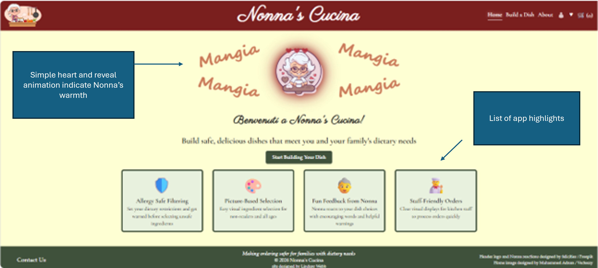
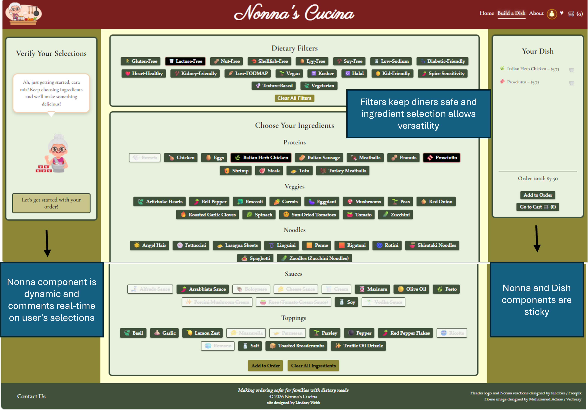
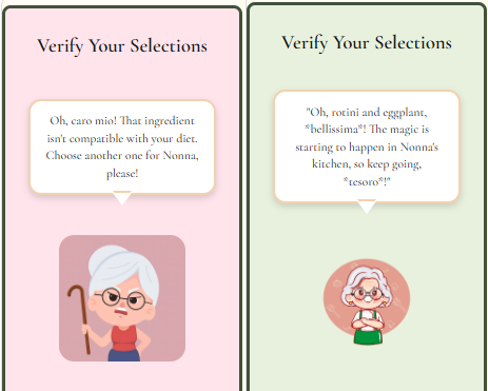
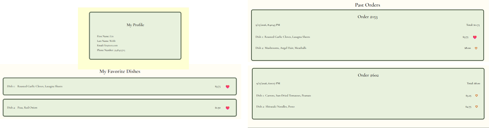
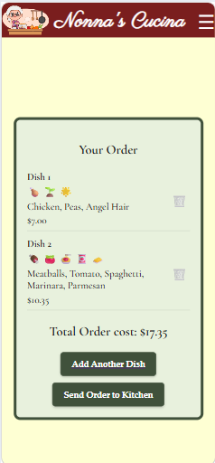
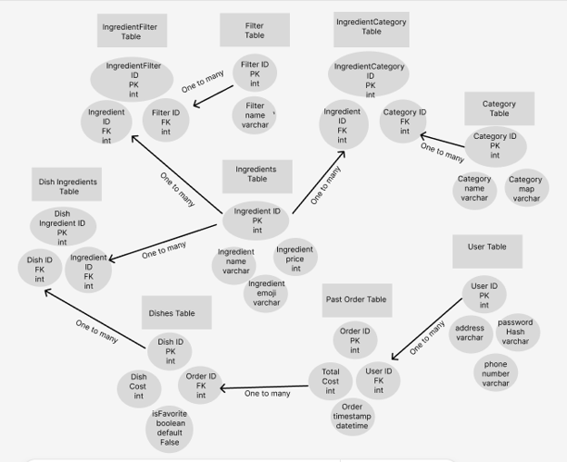

# Nonna's Cucina

## 🍝 Elevator Pitch

Nonna's Cucina was inspired by families like mine with complex dietary needs — they deserve tools that make eating safe, simple, and stress-free. It's a full-stack, accessible meal-building app that lets users filter out unsafe ingredients, build a custom dish from what's left, and send their order straight to the "kitchen," all guided by Nonna — a warm, reactive character who greets users and gives real-time feedback as they build their meal. The app is designed to work for non-readers, non-verbal users, limited-English speakers, and users of all ages and abilities, turning a stressful, error-prone process into a fast, confident, and even delightful ordering experience.

---

## 🛠️ Technologies Used

### Backend
- Java 21
- Spring Boot 3.3.4
- Spring Data JPA / Hibernate
- Spring Security with JWT authentication (jjwt 0.11.5)
- Maven
- MySQL

### Frontend
- React
- Vite
- JavaScript
- CSS
- Fetch API

### Tools
- IntelliJ IDEA (backend)
- VS Code (frontend)
- Git / GitHub
- Figma (wireframes & ERD)
- Postman (API testing)

---

## ⭐ MVP Features

### Dish Builder with Dietary Filters
- Users select any dietary restrictions they need to follow (allergies, intolerances, preferences) without needing to know which ingredients fall into each category — the app handles that automatically.
- Restricted ingredients are disabled from selection; if a user tries to select one anyway, Nonna gently warns them it isn't a safe choice.
- Multiple filters can be applied at once, supporting users with more than one dietary need.

### Nonna, the Guide Character
- Nonna greets users on arrival and sets a warm, welcoming tone for the experience.
- Nonna reacts in real time as ingredients are added or removed, giving feedback and personality throughout the dish-building process.
- Nonna's responses are generated via the Gemini API, so a valid Gemini API key is required for this feature to function fully (see Installation Instructions).

### Live Dish Panel & Cart Flow
- As ingredients are selected, the dish panel updates instantly to reflect the current build.
- Users can remove ingredients and adjust their choices before finalizing.
- Completed dishes are sent to the cart; filters and the builder reset automatically, ready for the next dish.

### Order Review & Kitchen Submission
- The Order page lets users review all dishes, remove any dish, or return to Build-a-Dish to add more.
- Finalizing an order sends it to the kitchen and returns a confirmation message.
- The kitchen sees the same visual layout as the customer's build, making meal preparation accurate and error-resistant.

### Accessibility
- Picture-based buttons support non-readers, non-verbal users, and limited-English speakers.
- ARIA tags throughout support screen reader users.
- Color-blind-safe design choices ensure filters and warnings are distinguishable without relying on color alone.

### Supporting Pages
- **About page** with project details and a feedback form.
- **Navigation bar** that lets users move between pages without losing their in-progress dish or order.

---

## 📱 Responsive Design

Nonna's Cucina was built with dedicated breakpoints for desktop, tablet, and mobile:

- **Desktop:** Full multi-column layout across the home screen and Build-a-Dish page.
- **Tablet:** The home screen rearranges into a 2×2 grid layout.
- **Mobile:** The home screen collapses into a 1×4 vertical stack.
- **Build-a-Dish (mobile):** The four main components (filters, ingredients, dish panel, Nonna) stack vertically so users never have to scroll sideways.
- **Navigation (mobile/tablet):** The nav bar collapses into a hamburger menu to preserve screen space.

---

## 🚀 Installation Instructions

### Prerequisites
- Java 21
- Node.js and npm
- MySQL
- Maven (or use the included `mvnw` wrapper)
- Git

### 1. Clone the repositories

```
git clone https://github.com/<your-org-or-username>/nonnas-cucina-backend.git
git clone https://github.com/<your-org-or-username>/nonnas-cucina-frontend.git
```

### 2. Database Setup

Create a local MySQL database:

```sql
CREATE DATABASE nonnas_cucina;
```

### 3. Backend Setup

Navigate to the backend directory:

```
cd nonnas-cucina-backend
```

Configure your local database connection and JWT secret in `src/main/resources/application.properties` (or via environment variables):

```
spring.datasource.url=jdbc:mysql://localhost:3306/nonnas_cucina
spring.datasource.username=<your_mysql_username>
spring.datasource.password=<your_mysql_password>

jwt.secret=<your_jwt_secret_key>
gemini.api.key=<your_gemini_api_key>
```

> A Gemini API key is required for Nonna's reactive, AI-generated responses to work. You can generate one at [Google AI Studio](https://aistudio.google.com/app/apikey).

Install dependencies and run the backend:

```
./mvnw clean install
./mvnw spring-boot:run
```

The backend runs on embedded Tomcat and serves the REST API at:

```
http://localhost:8080
```

### 4. Frontend Setup

In a separate terminal:

```
cd nonnas-cucina-frontend
npm install
npm run dev
```

The Vite development server is typically available at:

```
http://localhost:5173
```

Both the backend and frontend must be running to use the full application locally.

---

## 📐 Wireframes

Initial wireframes used to plan the dish-builder flow, order flow, and account pages (Profile / Past Orders / Favorites):

🔗 [View Complete Wireframes on Figma](https://www.figma.com/design/2B6voqe6rgF7hboei1bnCk/Untitled?node-id=0-1&t=hOswWw2X7NFZRTrp-1)

### Nonna's Cucina Homepage

<p align="center"> </p>

### Build A Dish with Nonna

<p align="center"> </p>

### Nonna's Personal Messages and Advice

<p align="center"> </p>

### Personalization of Experience

<p align="center"> </p>

### Mobile View

<p align="center"> </p>

---

## 🗄️ ER Diagram

The relational data model showing Users, Dishes, Ingredients, and Past Orders:

🔗 [View ERD on Figma](https://www.figma.com/design/3tcowkqGhvBoqyzeQVNOkN/ERD-Nonna-s-Cucina?node-id=1-2&t=IuJvYZgu09DooLts-1)

<p align="center"> </p>

---

## 🔮 Unsolved Problems & Future Features

### Menu & Ordering Expansion
- Expand the menu to include appetizers, beverages, and desserts.
- Add checklist of common preparation instructions (e.g., "on the side," "medium-well").
- Add tax calculation and discount codes for a more realistic restaurant checkout experience.
- Add a **"Special Instructions" notepad** on each dish so users can note freeform prep requests alongside their filtered ingredients.

### User Roles & Staff Views
- Introduce distinct **user roles**: Admin, Staff (kitchen/waiter), and Customer.
- **Backend:** add a `role` field to the User entity (or a related `Role` entity for many-to-many support), enforce role-based endpoint access via Spring Security (`@PreAuthorize` / role-based filters), and scope JWT claims to include role for frontend routing.
- **Kitchen staff screen:** a queue view of incoming orders showing each dish's built ingredients, images, and special instructions, with an action to mark dishes/orders as in-progress or complete.
- **Waiter screen:** a table/order-assignment view to associate orders with tables or customers and track order status through to delivery.
- Frontend route guarding so each role only sees the screens relevant to them.

### Loyalty Program
- Add a **loyalty card** feature that rewards repeat customers.
- **Backend:** new `LoyaltyAccount` entity linked one-to-one with User (points balance, tier), a `LoyaltyTransaction` entity to log point earns/redemptions per order, and a service to calculate points earned per completed order (and apply redemptions at checkout).
- **Frontend:** a loyalty balance/tier display on the Profile page, and a redemption option at checkout.

### Security & Access Control Notes
- **`POST /gemini` is fully public** (`permitAll()`, no auth required). This is reasonable today since Build-a-Dish doesn't require login, but it also means anyone can hit the Gemini endpoint directly with no rate limiting — a direct path to burning through API quota, as seen during testing. Not a rubric blocker, but worth revisiting (auth and/or rate limiting) before this goes anywhere public.
- **No admin/role distinction on data-management routes** — any authenticated user, not just an "admin," can currently POST/PUT/DELETE ingredients, filters, and categories. These routes were originally built for DB setup and testing; acceptable for this project's current scope, but should be locked down behind the planned Admin role (see User Roles & Staff Views) before going further.

### Account Features
- No `.env` / base-URL configuration on the frontend yet — the API base URL is currently hardcoded to `http://localhost:8080`.
- Favorites are currently tracked via a boolean `isFavorite` flag on the Dish entity rather than a dedicated User-Dish join table. This works correctly today because each dish belongs to exactly one order belonging to exactly one user, but a join table would be a more scalable long-term design.
- Add password reset / account recovery flow.
- Expand dietary filtering to support saved dietary profiles per user, rather than re-filtering every order.

### General
- Add a shared navigation sidebar component across all account pages for a more consistent UI.
- Expand automated test coverage across backend services and controllers.
- Add full-stack deployment (currently local-only).
- Improve form validation and user-facing error handling for failed orders or invalid ingredient combinations.

The app is already structured to scale, so these features can be layered in one at a time without breaking existing functionality.

---

## 📚 What I Learned

Building Nonna's Cucina provided hands-on experience with:

- Designing and implementing JWT-based authentication with Spring Security
- Debugging complex Hibernate/JPA issues, including entity graph fetching, lazy-loading proxies, and Cartesian product bugs from nested collection joins
- Designing DTOs to control serialized API responses and avoid infinite recursion
- Connecting a React frontend to a Spring Boot REST API
- Designing relational data models with MySQL
- Designing for accessibility: ARIA tags, color-blind-safe UI, and picture-based interaction patterns
- Building responsive layouts with dedicated breakpoints for desktop, tablet, and mobile
- Debugging frontend, backend, database, and authentication issues end-to-end
- Iterating on UI/UX based on wireframes and evolving requirements

---

## 👤 Author

Built by **Lindsay**, as part of the LaunchCode Women+ Software Development Bootcamp, Unit 2 Final Project.

---

## 📝 License

Nonna's Cucina was created for educational and portfolio purposes.
